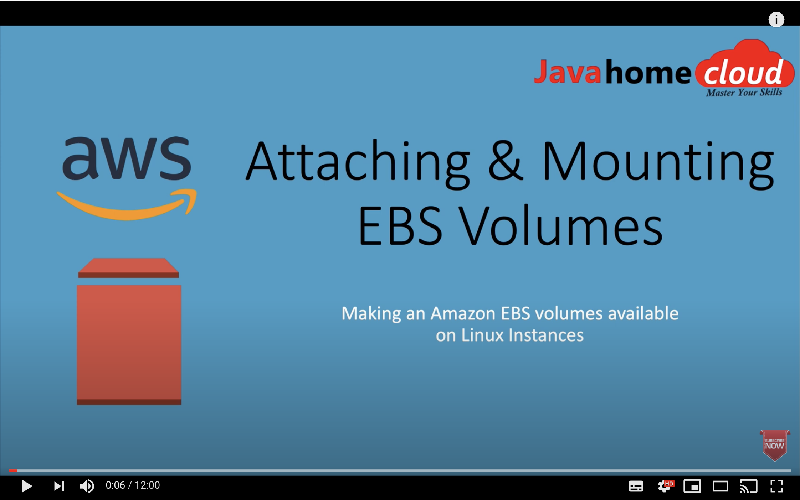

# Inspiration

Inspiration for this repo was a YouTube tutorial from [Java Home Cloud](https://www.youtube.com/javahomecloud) where it was demonstrated how to create a new EC2 instance, EBS volume and then attaching and mounting the volume.

<p align="left">
  <a href="https://youtu.be/EkxoxobQbRQ">
    
  </a>
</p>

## Scope

I wanted to take a step further and automate the instructions. This includes:

- Using modules from Terraform registry
- Using cloud init config for mounting attached EBS volume 
- Using cloud init config for placing a user ssh public key on the EC2 instance
- Encrypting all EBS volumes by default

The idea is that infrastructure should be setup without human intervention

## Terraform commands

This is how infrastrucutre is setup with Terraform:

- See instruction on how to generate a new [SSH key](https://help.github.com/en/github/authenticating-to-github/generating-a-new-ssh-key-and-adding-it-to-the-ssh-agent) and adding it to the ssh-agent
- `export TF_VAR_public_key=$(ssh-keygen -y -f ~/.ssh/id_rsa)` _(This will be required unless public_key in variables.tf is already set. This public ssh key will be placed on the launched EC2 instances. And a user called "admin" will be able to log in without a password)_
- `terraform init`
- `terraform apply -auto-approve`

```
.
├── README.md
├── data.tf                         -> Among other things, it contains data sources for template files
├── ebs-volumes.tf                  -> EBS volumes are created and attached to EC2 instance
├── ec2.tf                          -> EC2 instance is created
├── pics
│   └── volume.png
├── provider.tf
├── security.tf                     -> Security group allowing you to SSH to the public EC2 instance
├── templates
│   ├── cloud-config-runcmd.tpl     -> Template responsible mounting a volume
│   └── cloud-config-users.tpl      -> Added a user ssh key to the EC2 instance
├── terraform.tfvars
├── variables.tf
└── vpc.tf
```

## Test

1. Log in to AWS console and conform that a block device other than root volume is attached to the EC2 instance
2. SSH to the EC2: `ssh admin@[PUBLIC_IP_OF_EC2_INSTANCE]`
3. SSH to the EC2 instance and type `df -BG`. Confirm you have `/data` directory

## Reference

- [cloud-init Documentation](https://cloudinit.readthedocs.io/)
- [Terraform Registry](https://registry.terraform.io/)
